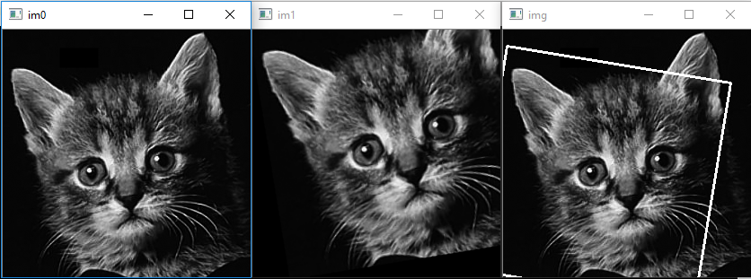

# LogPolarFFTTemplateMatcher

This project is an opencv implementation of rotation and scale invariant Log-Polar FFT template matcher.

Dependencies: if you want build test, you'll need gtest library.

Appended canny preprocessing, results become more robust.
You can change its parameters in LogPolarFFTTemplateMatch method.

Usage example:

``` cpp
#include "fftm.hpp"
using namespace std;
using namespace cv;
//-----------------------------------------------------------------------------------------------------
//
//-----------------------------------------------------------------------------------------------------
int main(int argc, unsigned int** argv)
{
    Mat im0 = imread("cat.png", 1);
    Mat im1 = imread("cat_part.png", 1);

    imshow("im1", im1);
    imshow("im0", im0);

    // As input we need equal sized images, with the same aspect ratio,
    // scale difference should not exceed 1.8 times.

    RotatedRect rr = LogPolarFFTTemplateMatch(im0, im1,200,100);

    // Plot rotated rectangle, to check result correctness
    Point2f rect_points[4];
    rr.points(rect_points);
    for (int j = 0; j < 4; j++)
    {
        line(im0, rect_points[j], rect_points[(j + 1) % 4], Scalar(255, 0, 0), 2, CV_AA);
    }

    imshow("result", im0);

    waitKey();
}
```

Program will show result as below:



References
----------
(1) An FFT-based technique for translation, rotation and scale-invariant
    image registration. BS Reddy, BN Chatterji.
    IEEE Transactions on Image Processing, 5, 1266-1271, 1996
    
(2) An IDL/ENVI implementation of the FFT-based algorithm for automatic
    image registration. H Xiea, N Hicksa, GR Kellera, H Huangb, V Kreinovich.
    Computers & Geosciences, 29, 1045-1055, 2003.
    
(3) Image Registration Using Adaptive Polar Transform. R Matungka, YF Zheng,
    RL Ewing. IEEE Transactions on Image Processing, 18(10), 2009.
    
Based on python version of algorithm:  http://www.lfd.uci.edu/~gohlke/code/imreg.py.html 
